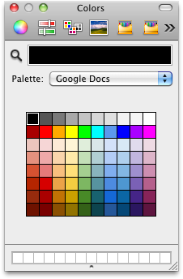
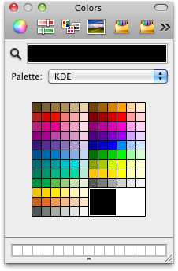

# Swatches

A highly versatile color picker for Mac OS X using the RCPX format for color swatches. If you've seen a set of color swatches in some program somewhere, chances are it's in here.

Built on 10.6.8, tested on 10.6.8 (Snow Leopard) and 10.14.6 (Mojave).

The full list of swatch sets can be seen at the [Museum of Computer & Video Game Color Palettes](http://www.kreativekorp.com/moccp/). Here is just a small sampling.

                                         
